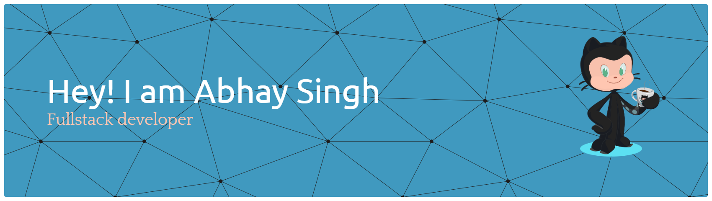

<!-- 💫 Elegant GitHub Profile README Template for Abhay Singh -->

<!-- Banner -->

  

<!-- Typing Animation -->

  

---

<h2 align="center">🌟 About Me</h2>

🎓 Final Year <b>B.Tech CSE (Cybersecurity)</b> student & lifelong learner 
💻 <b>Java Full-Stack Developer</b> | MERN Stack Enthusiast 
📚 Mastering <b>Spring Boot</b>, <b>React.js</b>, and <b>System Design</b> 
🛠️ Building impactful projects: <b>WorkLog, Edlly</b> 
✍️ Passionate about <b>story writing and creative side projects</b>

---

<h2 align="center">🛠️ Tech Stack</h2>

### 🚀 Languages & Frameworks

  

### 🧰 Tools & Platforms

  

---

<h2 align="center">📊 GitHub Stats</h2>

  
  

  

---

<h2 align="center">🏆 Achievements & Trophies</h2>

  

---

<h2 align="center">🚀 Featured Projects</h2>

  
📂 Click to View Projects
 

  🔹 <b><a href="https://github.com/Abhay-Singh-00/WorkLog">WorkLog</a></b> – Employee performance & compensation management system

  🔹 <b><a href="https://github.com/Abhay-Singh-00/Edlly">Edlly</a></b> – AI-driven Virtual School with gamification

  🔹 <b><a href="https://github.com/Abhay-Singh-00/carfinder">Car Finder</a></b> – React.js-based car search app with filters

  🔹 <b><a href="https://github.com/Abhay-Singh-00/todolist">To-Do List</a></b> – Simple and effective task manager

---

<h2 align="center">📬 Connect With Me</h2>

  
  
  

---

<h2 align="center">👀 Visitors</h2>

  

---

<h3 align="center">✨ "Code, Create, Innovate!" ✨</h3>
